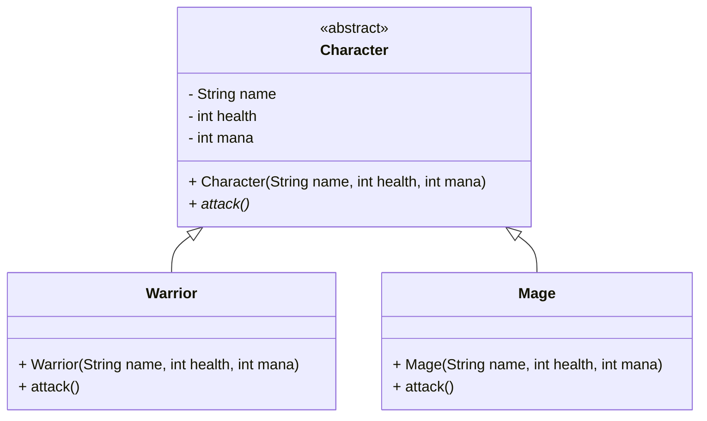

## クラス図

```mermaid
classDiagram
    class Character {
        <<abstract>>
        - String name
        - int health
        - int mana
        + Character(String name, int health, int mana)
        + attack()*
    }

    class Warrior {
        + Warrior(String name, int health, int mana)
        + attack()
    }

    class Mage {
        + Mage(String name, int health, int mana)
        + attack()
    }

    Character <|-- Warrior
    Character <|-- Mage
```