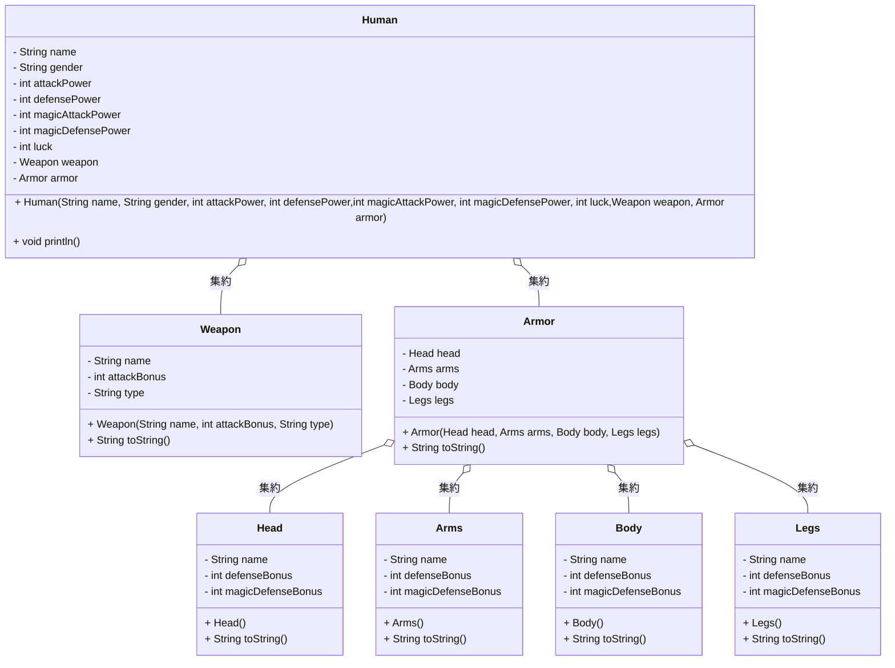

## ここでやっていること
- オブジェクト指向の「集約」について、 下記の仕様に基づいて、UMLのクラス図とJavaコードを記載する

## 仕様
- このPRGである 
- 人族やモンスターなどのキャラクターがいる 
- キャラクターには、性別、攻撃力・守備力・魔法攻撃力・魔法防御力・運を持っている 
- 人族は、装備（攻撃をするための武器、防御するための防具）を持っている。 
- 防具は、頭、腕、上半身、下半身の４つから成り立つ

## 説明 矢印の説明
### `o--`: 集約（Aggregation）
- 部分的に所有している関係
  - メソッド等で部分を取り出すことができれば集約となる。（反対にメソッド等で部分を取り出すことができず、全体が`null`になることで削除されてしまう場合はコンポジットとなる）
- 部分（部位）は全体（Armor）のライフサイクルに依存しない
- Armorが破棄されても、部位（Head, Armsなど）は独立して存在可能
- 部分（部位）は他の全体（別のArmorなど）に属することが可能

## 似ているもの
### `-->`: 関連（association）
- 2つのクラス間で緩やかな関係
- 所有関係がない。何かのクラスに所有されていない
- 片方のオブジェクトが削除されても、もう片方のオブジェクトが存在可能 
- 複数のオブジェクト間で同じインスタンスを共有できる
- 集約とは似たようなコードになりやすいため、ドキュメントやクラス図で表現される
- 参照方向（「双方向」か「単方向」）と 多重度を記載する

※ 理解を深めるためにChatGPTを利用しています。
なるべく、サイトや書籍から拾ってますがご了承ください