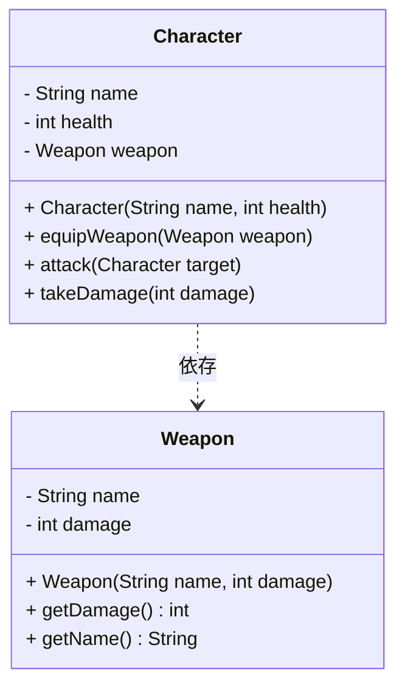
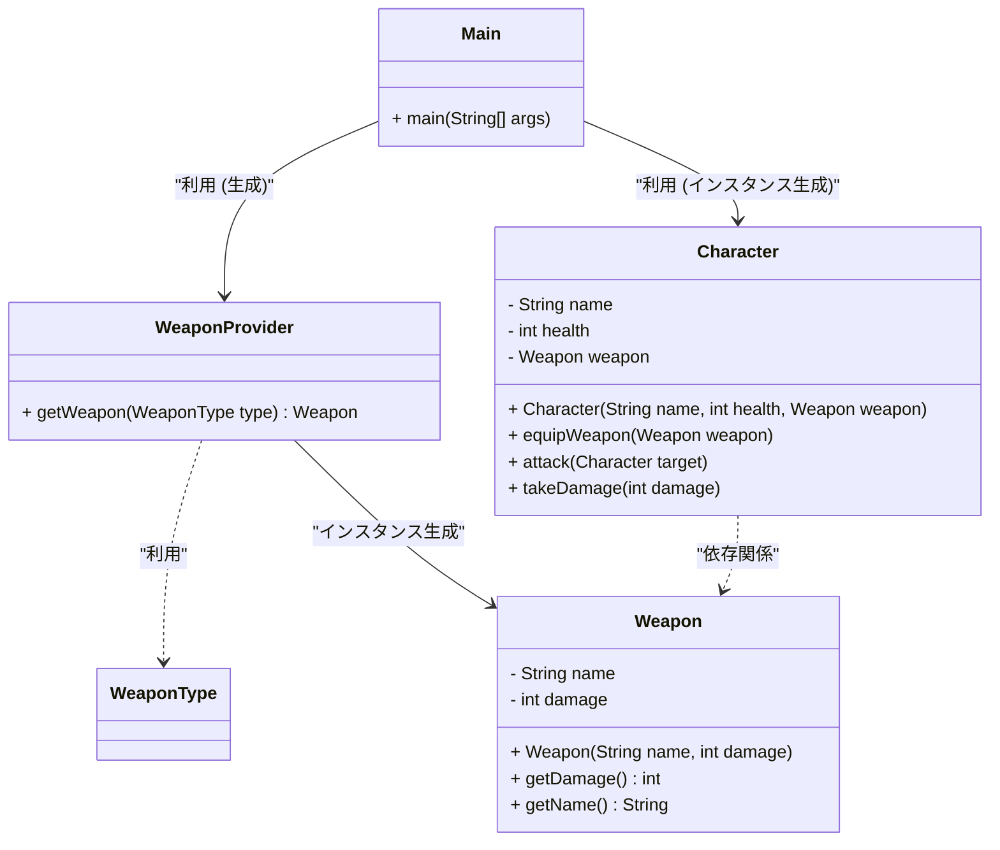

# 依存関係

## 依存関係とは
- 関連、集約、コンポジションはオブジェクト間の特定の強い関係を特徴づける概念
- より弱い関係を表す依存関係（dependency）がある
- 関連の中では最も弱い関係である

## どのような時に依存関係が成立するのか？
あるクラスやメソッドが他のクラスやメソッドに一時的に依存している状態 を指します。 
通常、メソッドの引数やローカル変数として他のクラスのインスタンスを受け取る場合に成立します。

### 依存性注入したクラス図

## 解決方法
依存性注入(dependency injection, DI)・制御の反転(Inversion of Control、IoC)が解決策としてある。 

## 依存性注入
依存性注入とは、依存関係となっている箇所が外部に委譲させ、外部からオブジェクト（インスタンス）を注入することである。 
外部に委譲させるというのは、依存関係をまとめるクラスが他にあるということ 
また、生成を外部に委譲することで、単一責任の原則（Single Responsibility Principle, SRP）に沿った設計をすることができる

### やり方は3つある
### コンストラクトインジェクション
- 依存性をクラスのメンバー変数・コンストラクタを通じて渡すようにする。
### セッターインジェクション
- セッターを利用して生成したインスタンスを渡すようにする
### インターフェースインジェクション
- 依存性を注入するためのメソッドを提供するインターフェースで渡す