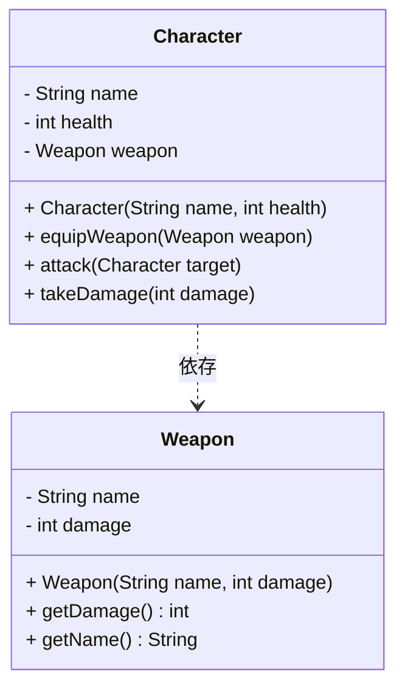

# 依存関係

## 依存関係とは
- 関連、集約、コンポジションはオブジェクト間の特定の強い関係を特徴づける概念
- より弱い関係を表す依存関係（dependency）がある
- 関連の中では最も弱い関係である

## どのような時に依存関係が成立するのか？
あるクラスやメソッドが他のクラスやメソッドに一時的に依存している状態 を指します。 
通常、メソッドの引数やローカル変数として他のクラスのインスタンスを受け取る場合に成立します。

## 解決方法
依存性注入(dependency injection, DI)・制御の反転(Inversion of Control、IoC)が解決策としてある。 
これらについては、learn/example/rpg/dI/rpg に記載されている