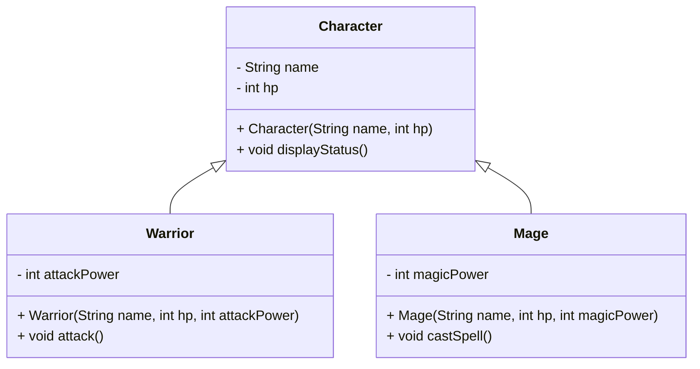

# 継承
## 継承とは
- 既存クラスをもとに新しいクラスを作成する仕組み
- 新しいクラスをサブクラス、既存クラスが親クラス・スーパークラスと表現される
- サブクラスは、親クラスのメンバ変数やメソッドを受け継ぐことができる
- 共通化することで重複したコードを軽減できる・親クラスの機能を再利用することができる
- 

## クラス図

```mermaid
classDiagram
    class Character {
        - String name
        - int hp
        + Character(String name, int hp)
        + void displayStatus()
    }

    class Warrior {
        - int attackPower
        + Warrior(String name, int hp, int attackPower)
        + void attack()
    }

    class Mage {
        - int magicPower
        + Mage(String name, int hp, int magicPower)
        + void castSpell()
    }

    Character <|-- Warrior
    Character <|-- Mage
```